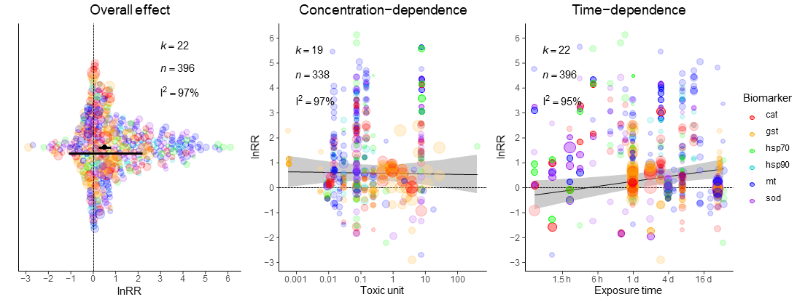

# Transcriptional responses as biomarkers of general toxicity
## A systematic review and meta-analysis on metal-exposed bivalves

[![CC BY 4.0][cc-by-shield]][cc-by]

Ekelund Ugge GMO, Sahlin U, Jonsson A, Berglund O, 2022. Transcriptional responses as biomarkers of general toxicity: a systematic review and meta-analysis on metal-exposed bivalves. Environmental Toxicology and Chemistry. [DOI: 10.1002/etc.5494](https://doi.org/10.1002/etc.5494).

#### Graphical abstract

#### Abstract
Through a systematic review and a series of meta-analyses, we evaluated the general responsiveness of putative transcriptional biomarkers of general toxicity and chemical stress. We targeted metal exposures performed on bivalves under controlled laboratory conditions, and selected six transcripts associated with general toxicity for evaluation: catalase (*cat*), glutathione-S-transferase (*gst*), heat shock proteins 70 and 90 (*hsp70*, *hsp90*), metallothionein (*mt*) and superoxide dismutase (*sod*). Transcriptional responses (*n* = 396) were extracted from published scientific articles (*k* = 22) and converted to log response ratios (lnRRs). By estimating toxic units (TUs), we normalized different metal exposures to a common scale, as a proxy of concentration. Using Bayesian hierarchical random effect models, we then tested the effects of metal exposure on lnRR, both for metal exposure in general and in meta-regressions using TU and exposure time as independent variables. Corresponding analyses were also repeated with transcript and tissue as additional moderators. Observed patterns were similar for general as for transcript- and tissue-specific responses. The expected overall response to arbitrary metal exposure was a lnRR of 0.50, corresponding to a 65 % increase relative a non-exposed control. However, when accounting for publication bias, the estimated ‘true’ response showed no such effect. Furthermore, expected response magnitude increased slightly with exposure time, but there was little support for general monotonic concentration-dependence with regards to TU. Altogether, this work reveals potential limitations that need consideration prior to applying the selected transcripts as biomarkers in environmental risk assessment.

:mag_right: :page_facing_up: :page_with_curl: :shell: :droplet: :test_tube: :skull_and_crossbones: :dna: :chart_with_upwards_trend: :chart_with_downwards_trend:

#### Data and code
Here, we provide data and R code to reproduce the results presented in '[Transcriptional responses as biomarkers of general toxicity](https://doi.org/10.1002/etc.5494)'. Please see the [metadata](metadata.pdf) for an overview. The full dataset (including raw data and background data not included as results or in the analyses) is available on [Mendeley](https://doi.org/10.17632/83jc4yv35h).

#### License
This work is licensed under a
[Creative Commons Attribution 4.0 International License][cc-by].

[![CC BY 4.0][cc-by-image]][cc-by]

[cc-by]: http://creativecommons.org/licenses/by/4.0/
[cc-by-image]: https://i.creativecommons.org/l/by/4.0/88x31.png
[cc-by-shield]: https://img.shields.io/badge/License-CC%20BY%204.0-lightgrey.svg
